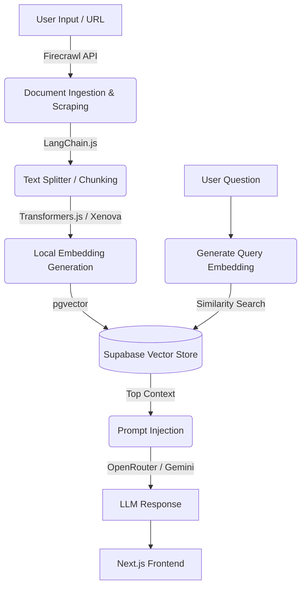

# RAG Document Assistant

[]()
[]()
[]()
[]()

> A Retrieval-Augmented Generation (RAG) application that ingests web pages and documents to provide context-aware LLM responses, built to reduce AI hallucinations.

**Live Demo:** Currently building V2 with an improved UI/UX! 🚧

 

## Overview

This project is a functional MVP of an intelligent document assistant. It allows users to input URLs or text, processes that data into vector embeddings, and uses semantic search to answer questions strictly based on the provided context. 

The goal of this application is to demonstrate a complete AI data pipeline: from raw data ingestion and chunking to vector storage and prompt injection.

## System Architecture

The pipeline is designed to be efficient and modular:



## Tech Stack

- **Frontend & API:** Next.js (App Router), React, TypeScript, TailwindCSS.
- **AI Orchestration:** `LangChain.js`.
- **Data Ingestion:** `Firecrawl` API.
- **Embeddings:** `@xenova/transformers`.
- **Vector Database:** `Supabase` + `pgvector`.
- **LLM Provider:** OpenRouter / Gemini API.

## Technical Decisions & Trade-offs

When building this MVP, I focused on optimizing for cost, data quality, and privacy:

- **Handling Dynamic Content:** Traditional scrapers (Puppeteer/Cheerio) return messy HTML and struggle with Single Page Applications. I implemented **Firecrawl** because it easily handles JS-heavy sites and outputs clean Markdown, which drastically improves the LLM's reading comprehension.
- **Local vs. API Embeddings:** Instead of relying on paid APIs (like OpenAI's `text-embedding-ada-002`), I integrated `@xenova/transformers` to generate embeddings locally using ONNX. **Trade-off:** It requires a bit more processing power on the server/client, but it completely eliminates embedding API costs and reduces network latency during ingestion.
- **BYOD (Bring Your Own Database):** To avoid the complexity and cost of managing a multi-tenant vector database, the app is designed so users can connect their own Supabase instance. This ensures user data privacy while keeping the application lightweight.


## Getting Started

Follow these steps to run the project locally.

### 1. Prerequisites
- Node.js 18+ and `npm` / `pnpm`
- A Supabase project with the `pgvector` extension enabled.
- API Keys for Firecrawl and your chosen LLM provider (OpenRouter/Gemini).

### 2. Environment Variables
Clone the repository and create a `.env` file in the root directory:

```env
# Supabase Configuration
NEXT_PUBLIC_SUPABASE_URL=your_supabase_url
NEXT_PUBLIC_SUPABASE_ANON_KEY=your_supabase_anon_key

# AI & Scraping Keys
FIRECRAWL_API_KEY=your_firecrawl_api_key
OPENROUTER_API_KEY=your_openrouter_key
```

### 3. Database Setup (Supabase)
Run the following SQL in your Supabase SQL Editor to prepare the vector store:
```sql
create extension if not exists vector;

create table documents (
  id bigserial primary key,
  content text,
  metadata jsonb,
  embedding vector(384) 
);

create table articles (
  id bigserial primary key,
  markdown text,
  created_at timestamp with time zone default timezone('utc'::text, now())
);

-- Create a function to search for documents
create or replace function match_documents (
  query_embedding vector(384),
  match_count int default 4
) returns table (
  id bigint,
  content text,
  metadata jsonb,
  similarity float
)
language plpgsql
as $$
begin
  return query
  select
    documents.id,
    documents.content,
    documents.metadata,
    1 - (documents.embedding <=> query_embedding) as similarity
  from documents
  order by documents.embedding <=> query_embedding
  limit match_count;
end;
$$;
```

### 4. Installation & Run
```bash
npm install
npm run dev
```
Open [http://localhost:3000](http://localhost:3000) with your browser to see the result.