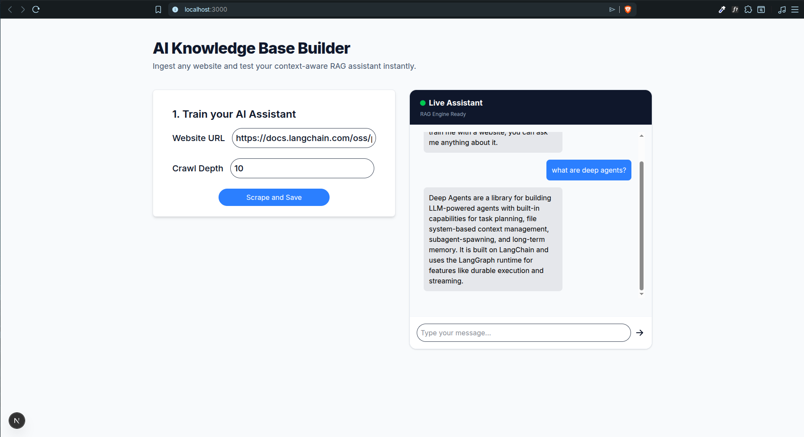
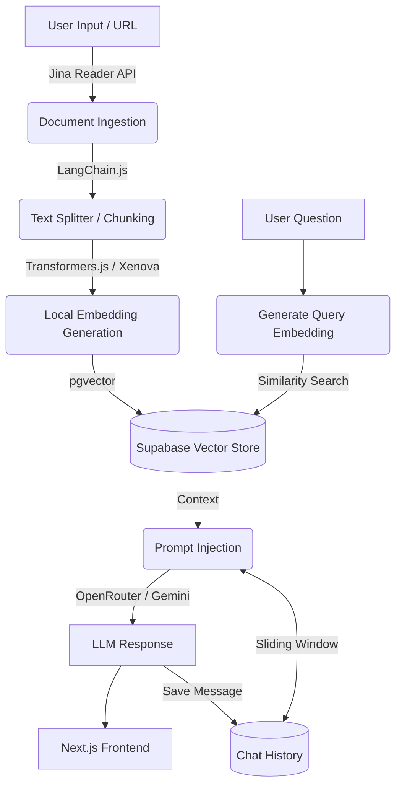

# RAG Document Assistant

[]()
[]()
[]()
[]()

> A Retrieval-Augmented Generation (RAG) application that ingests web pages and documents to provide context-aware LLM responses, built to reduce AI hallucinations.

**Live Demo:** Currently building V2 with an improved UI/UX! 🚧

 

## Overview

This project is a functional MVP of an intelligent document assistant. It allows users to input URLs or text, processes that data into vector embeddings, and uses semantic search to answer questions strictly based on the provided context. 

The goal of this application is to demonstrate a complete AI data pipeline: from raw data ingestion and chunking to vector storage and prompt injection.

## System Architecture

The pipeline is designed to be efficient and modular:



## Tech Stack

- **Frontend & API:** Next.js (App Router), React, TypeScript, TailwindCSS.
- **AI Orchestration:** `LangChain.js`.
- **Data Ingestion:** `Firecrawl` API.
- **Embeddings:** `@xenova/transformers`.
- **Vector Database:** `Supabase` + `pgvector`.
- **LLM Provider:** OpenRouter / Gemini API.

## Technical Decisions & Trade-offs

When building this MVP, I focused on optimizing for cost, data quality, and privacy:

- **Handling Dynamic Content:** Switched from Firecrawl to Jina Reader. While Firecrawl is powerful, Jina provides more tokens to translate HTML to Markdown, while keeping it structured for LLM performance. 
- **Local vs. API Embeddings:** Instead of downloading thousands of vectors into the Node.js runtime (which caused memory pressure), the system delegates the **Cosine Similarity** math directly to PostgreSQL using pgvector. 
- **Conversation Memory (Sliding Window):** Implemented a persistent chat history in Supabase *(Currently it is set to 6 messages but it can be changed)*. The system retrieves the last N messages to provide context for follow-up questions, allowing for a natural conversation flow without exceeding the LLM's context window.
- **Latency & LLM Inference:** Currently, the chat response time is tied to the full completion of the LLM generation (avg. 10-20s). While the Vector Search in Supabase is sub-millisecond, the end to end latency is dominated by the remote inference. For this MVP, I prioritized a simple Request-Response architecture over the complexity of WebSockets or Server-Sent Events (SSE)


## Getting Started

Follow these steps to run the project locally.

### 1. Prerequisites
- Node.js 18+ and `npm` / `pnpm`
- A Supabase project with the `pgvector` extension enabled.
- API Keys for Firecrawl and your chosen LLM provider (OpenRouter/Gemini).

### 2. Environment Variables
Clone the repository and create a `.env` file in the root directory:

```env
# Supabase Configuration
NEXT_PUBLIC_SUPABASE_URL=your_supabase_url
NEXT_PUBLIC_SUPABASE_ANON_KEY=your_supabase_anon_key

# AI & Scraping Keys
FIRECRAWL_API_KEY=your_firecrawl_api_key
OPENROUTER_API_KEY=your_openrouter_key
```

### 3. Database Setup (Supabase)
Run the following SQL in your Supabase SQL Editor to prepare the vector store:
```sql
create extension if not exists vector;

create table documents (
  id bigserial primary key,
  content text,
  metadata jsonb,
  embedding vector(384) 
);

create table articles (
  id bigserial primary key,
  markdown text,
  created_at timestamp with time zone default timezone('utc'::text, now())
);

create table chat_history (
  id bigserial primary key,
  role text not null, 
  content text not null,
  created_at timestamp with time zone default timezone('utc'::text, now())
);

-- Create a function to search for documents
create or replace function match_documents (
  query_embedding vector(384),
  match_count int default 4
) returns table (
  id bigint,
  content text,
  metadata jsonb,
  similarity float
)
language plpgsql
as $$
begin
  return query
  select
    documents.id,
    documents.content,
    documents.metadata,
    1 - (documents.embedding <=> query_embedding) as similarity
  from documents
  order by documents.embedding <=> query_embedding
  limit match_count;
end;
$$;
```

### 4. Installation & Run
```bash
npm install
npm run dev
```
Open [http://localhost:3000](http://localhost:3000) with your browser to see the result.

### 5. Roadmap

- [ ] **Streaming Responses:** Implement Server-Sent Events (SSE) or the Vercel AI SDK to stream the LLM response word-by-word, significantly improving the perceived latency and User Experience (UX).
- [ ] **UI/UX Decoupling:** Refactor the interface into dedicated routes (e.g., `/ingest` and `/chat`) to separate the knowledge management from the interaction layer, providing a cleaner, distraction-free user experience.
- [ ] **Multi-Context Workspaces:** Implement session management to allow multiple isolated chats. This will enable users to switch between different knowledge bases (e.g., a Python-focused assistant vs. a Java-focused one) without context contamination.