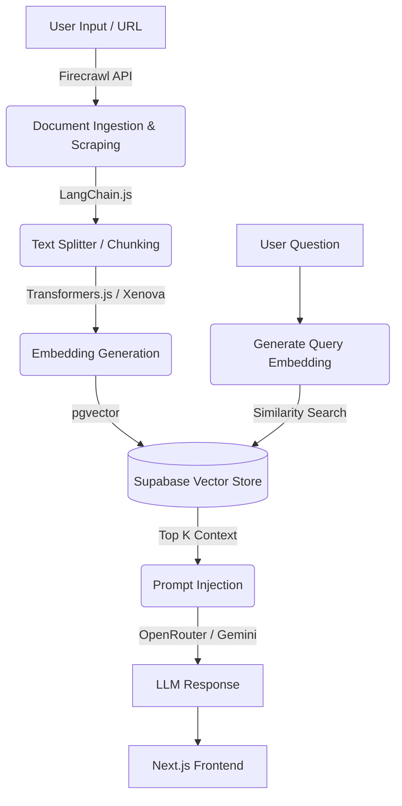

# RAG Document Assistant

[]()
[]()
[]()
[]()

> An advanced Retrieval-Augmented Generation (RAG) system capable of dynamic web scraping, document ingestion, and context-aware Q&A using LangChain.js and Vector Databases.

**Live Demo:** [Insert Vercel/Live URL here if you have one, or delete this line]

 
*(Note: Please add a screenshot of your chat interface here)*

## Overview

This project was built to explore and implement modern AI engineering patterns. It acts as an intelligent assistant that can ingest external knowledge (via URLs or documents), process the information into high-dimensional vectors, and generate highly accurate responses to user queries while significantly reducing LLM hallucinations.

## Architecture & Data Flow

The system follows a strict Clean Architecture pattern for AI data pipelines:




## Core Technologies

- **Frontend & API:** Next.js (App Router), React, TypeScript, TailwindCSS.
- **AI Orchestration:** `LangChain.js` for managing the RAG pipeline, prompts, and document loaders.
- **Data Ingestion:** `Firecrawl` API for robust, LLM-ready web scraping (bypassing anti-bot protections and parsing JS-heavy sites).
- **Embeddings:** `@xenova/transformers` running local models via ONNX runtime for efficient, low-latency embedding generation.
- **Vector Database:** `Supabase` utilizing the `pgvector` extension for storing and performing cosine similarity searches.
- **LLM Provider:** OpenRouter / Gemini API for final response generation.

## Getting Started

Follow these steps to run the project locally.

### 1. Prerequisites
- Node.js 18+ and `npm` / `pnpm`
- A Supabase project with the `pgvector` extension enabled.
- API Keys for Firecrawl and your chosen LLM provider (OpenRouter/Gemini).

### 2. Environment Variables
Clone the repository and create a `.env` file in the root directory:

```env
# Supabase Configuration
NEXT_PUBLIC_SUPABASE_URL=your_supabase_url
NEXT_PUBLIC_SUPABASE_ANON_KEY=your_supabase_anon_key

# AI & Scraping Keys
FIRECRAWL_API_KEY=your_firecrawl_api_key
OPENROUTER_API_KEY=your_openrouter_key
```

### 3. Database Setup (Supabase)
Run the following SQL in your Supabase SQL Editor to prepare the vector store:
```sql
create extension if not exists vector;

create table documents (
  id bigserial primary key,
  content text,
  metadata jsonb,
  embedding vector(384) 
);

create table articles (
  id bigserial primary key,
  markdown text,
  created_at timestamp with time zone default timezone('utc'::text, now())
);

-- Create a function to search for documents
create or replace function match_documents (
  query_embedding vector(384),
  match_count int default 4
) returns table (
  id bigint,
  content text,
  metadata jsonb,
  similarity float
)
language plpgsql
as $$
begin
  return query
  select
    documents.id,
    documents.content,
    documents.metadata,
    1 - (documents.embedding <=> query_embedding) as similarity
  from documents
  order by documents.embedding <=> query_embedding
  limit match_count;
end;
$$;
```

### 4. Installation & Run
```bash
npm install
npm run dev
```
Open [http://localhost:3000](http://localhost:3000) with your browser to see the result.

## 🧠 Engineering Decisions

- **Why Firecrawl?** Traditional scrapers (like Puppeteer or Cheerio) struggle with dynamic SPAs and return messy HTML. Firecrawl directly outputs clean, markdown-formatted data perfectly suited for LLM context windows.
- **Why Xenova / Transformers.js?** By generating embeddings locally via ONNX rather than calling external APIs (like OpenAI's `text-embedding-ada-002`), we drastically reduce API costs and network latency during the ingestion phase.
